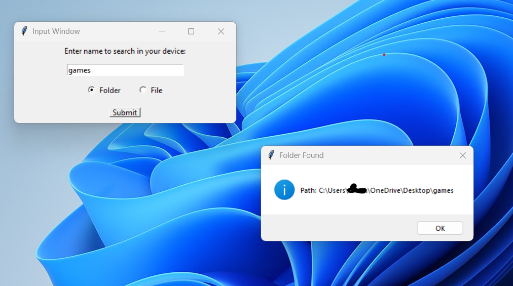
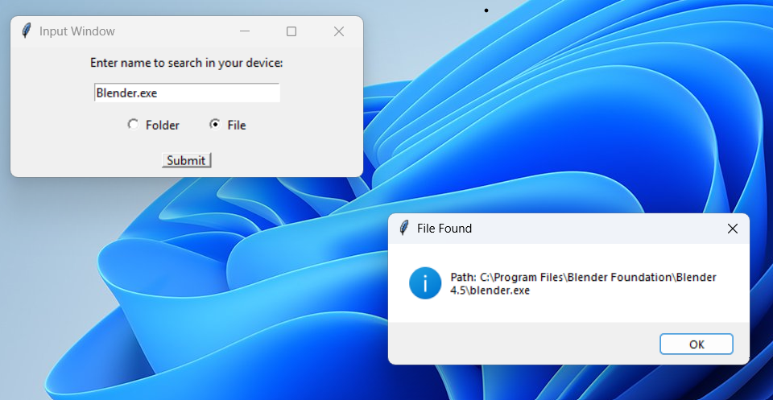

# File-or-Folder-Finder

file or folder finder is a python program that lets you find a certain folder or file just by puting its name it helps you find lost files if you remember the name or to find a virus in your computer as long as you know the file name

# Examples

## This is an example of the program finding a folder

## This is an example of the program finding a file

# Tutorial(click on the image to go to the youtube video)

)
